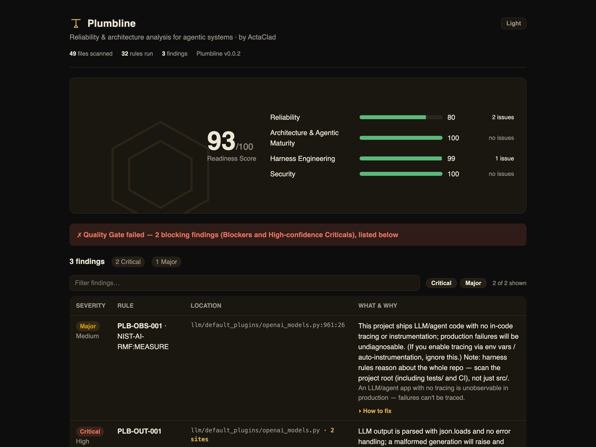

<!-- Plumbline README. Keep positioning-first. Update the badges/links when the
     repo and PyPI package are live. -->

<div align="center">

# Plumbline

**Security scanners tell you if your AI can be attacked.<br>Plumbline tells you if it can survive production.**

[](https://pypi.org/project/actaclad-plumbline/)
[](https://pypi.org/project/actaclad-plumbline/)
[](https://github.com/ActaClad/plumbline/actions/workflows/ci.yml)
[](LICENSE)
[](docs/sarif-code-scanning.md)

*The open-source reliability & architecture analyzer for LLM & agentic Python. A
plumb line checks whether a structure is built true; this one does the same for
your agents — your agent didn't get hacked, it fell over.*

`pip install actaclad-plumbline`

[Quickstart](#quickstart) · [What it checks](#what-it-checks) · [Why Plumbline](#why-plumbline) · [Contributing](CONTRIBUTING.md) · [by ActaClad](https://actaclad.com)

</div>

---

> **TL;DR** — Your agent didn't get hacked; it fell over. Plumbline is a
> deterministic static analyzer for the *reliability* of LLM & agentic Python. It
> catches missing timeouts, unbounded agent loops, and unguarded model-output
> parsing — the production failures security scanners walk right past. It runs
> fully offline, gates CI with SARIF output, and can export its rules as a
> prevention **skill-pack for your coding agent** (Claude Code, Cursor, …).

```bash
pipx install actaclad-plumbline    # or: uv tool install actaclad-plumbline
cd your-agent && plumb scan         # inside a repo, the path is optional
```

<p align="center">
  
</p>

## The problem

Agentic systems demo beautifully and break invisibly. They rarely fail because
they were attacked — they fail because they were **badly engineered**: a runaway
agent loop with no iteration cap, no fallback when a provider returns 429, an
`eval()` on model output that dies on the first unexpected token, unbounded
memory growth, a silent model swap that changed behavior, no verification step
so an early error rides all the way to the final answer.

AI-assisted coding makes this worse, not better. More agent code is being
written, faster, and reviewed less per line — and studies show AI-generated code
carries *more* of these defects, not fewer.

Existing static analyzers for AI code are all **security scanners**. They ask
*"is this code dangerous?"* That leaves an entire dimension unchecked.

## What Plumbline does

**Plumbline asks a different question: *will this system fall over in
production?*** It statically analyzes LLM and agentic code for reliability,
architecture, harness-engineering, and security defects — then tells you exactly
what, where, why it matters, and how to fix it.

It is **not a style linter.** It does taint/dataflow analysis to reason about
real properties of your code — does untrusted input reach a tool-enabled prompt,
is there a fallback path, is the agent loop bounded — not whitespace and naming.

Detection is **fully deterministic**: same code, same findings, every run.
Safe to gate a build on. (An optional AI layer enriches *fix suggestions* only —
never the detection itself.)

**No network. No telemetry.** The detection path never makes a network call and
collects no usage data — your source code never leaves your machine. The only
time Plumbline talks to the network is the *optional* AI fix-suggestion layer,
and only when you explicitly enable it. Your security team can verify this:
analysis runs fully offline.

**Two ways to use it — catch *and* prevent.** Run `plumb scan` in CI as the
deterministic gate; and `plumb export-skills` turns the same rule knowledge into
a prevention skill-pack your coding agent loads, so it writes timeout-wrapped,
bounded-loop, validated-I/O code *by default* — shifting these defects left of
the diff. ([Skill pack ↓](#prevent-dont-just-detect-the-skill-pack))

## What it checks

Four pillars, in priority order:

| Pillar | Examples of what it catches |
|---|---|
| **Reliability & Fault Tolerance** | missing timeouts/retries/fallbacks, bare excepts swallowing failures, unbounded memory, non-idempotent retried side effects, no output cap, reasoning-model misconfiguration (sampling params / thinking budget), leaked streaming connections |
| **Architecture & Agentic Maturity** | unbounded agent loops, no termination condition, no verification/self-critique node, untyped tools, RAG context overflow, prompt assembly anti-patterns |
| **Harness Engineering** | no evaluation suite, no golden datasets / ground-truth checks, model/prompt changes not gated by evals, no tracing or correlation IDs |
| **Security & Governance** | untrusted input into tool-enabled prompts, LLM output into eval/exec/shell/SQL, hardcoded secrets, unsanitized output rendering, PII into prompts, unauthenticated remote MCP servers |

**32 rules implemented today** (12 High-confidence/gating, 20 advisory),
weighted to the differentiated wedge — Reliability and Architecture lead, ahead
of Security. They are the validated core of a **61-rule taxonomy**; the rest is
published as a contributor roadmap. A rule ships gating only with a measured
precision number — advisory until then.

Full catalog: [`docs/specs/rule-catalog.md`](docs/specs/rule-catalog.md).
Every rule maps to OWASP LLM Top 10, OWASP Agentic Top 10, NIST AI RMF, or CWE
where applicable.

## Quickstart

```bash
pip install actaclad-plumbline

# Requires Python 3.11+ to *run* (it scans code of any Python version — it parses,
# never imports, your source). On a stock-macOS Python 3.9, or an externally
# managed one (Homebrew / uv / PEP 668), install it as an isolated CLI instead:
#   pipx install actaclad-plumbline        # or, if you use uv:
#   uv tool install actaclad-plumbline     # (uvx --from actaclad-plumbline plumb scan  to try without installing)

# scan a project — the Quality Gate runs by default
# (exit 1 on any Blocker or High-confidence Critical), so it's CI-ready as-is.
# Prints findings + the Readiness Score (a 0–100 dashboard; the gate, not the
# score, decides pass/fail).
plumb scan ./my-agent-app

# the path is optional — inside a repo, bare `plumb scan` scans the current
# directory. Pass one or more paths to narrow it (e.g. `plumb scan src/ tests/`).
plumb scan

# emit SARIF for GitHub code scanning / IDEs, JSON for tooling, and a
# self-contained offline HTML report
plumb scan ./my-agent-app --sarif plumbline.sarif --json plumbline.json --html report.html

# ...or just open a shareable, branded HTML report in your browser
plumb scan ./my-agent-app --open

# adopt incrementally on an existing repo: accept today's findings, gate on new ones
plumb baseline ./my-agent-app        # writes .plumbline-baseline.json
plumb scan ./my-agent-app            # only *new* findings fail the gate

# list loaded rules
plumb rules
```

Wiring it into CI takes one job — see [`docs/ci-integration.md`](docs/ci-integration.md).
On GitHub, the [Plumbline Action](action.yml) is five lines and uploads findings
straight to the Security tab ([SARIF → code scanning](docs/sarif-code-scanning.md));
there's also a [`pre-commit`](https://pre-commit.com) hook (`id: plumbline`).

Supported today: Python, with adapters for the raw OpenAI/Anthropic SDKs,
LangChain/LangGraph, and CrewAI. (More frameworks and languages on the roadmap —
[contributions welcome](CONTRIBUTING.md).)

> **Runs on Python 3.11+, scans code of any Python version.** Plumbline *parses*
> your source — it never imports or runs it — so your application's own Python
> version is irrelevant. If your app targets an older Python (3.8–3.10), just run
> the scan in a 3.11+ step (the GitHub Action brings its own Python, so CI is
> zero-friction). Run Plumbline on a Python at least as new as the newest syntax
> in your codebase; a file it can't parse is reported as an analyzer error and
> skipped, never crashing the run.

## Output

Each finding tells you:

- **what** — the defect, with a stable rule ID (`PLB-RES-001`)
- **where** — file and line
- **severity & confidence** — Blocker/Critical/Major/Minor/Info × High/Medium/Low
- **why it matters** — the concrete production failure it leads to
- **how to fix it** — a specific remediation, with a bad/good example
- **standard** — the OWASP/NIST/CWE reference where one applies

Plus a **Readiness Score** per pillar (a stakeholder roll-up — the pass/fail
Quality Gate is what you wire into CI).

<p align="center">
  
</p>

## Why Plumbline

- **Reliability-first, not security-only.** The unclaimed lane, and the one that
  maps to a failure you've actually seen in production.
- **Deterministic and trustworthy.** Reproducible findings you can gate a build
  on. Low false-positive rate is a first-class design goal, measured in
  [`/benchmark`](benchmark/).
- **Actionable.** Every finding ships with a fix, not just a flag.
- **Standards-grade.** SARIF 2.1.0; OWASP/NIST/CWE mappings.
- **Genuinely open.** Apache-2.0. The rule catalog is a community asset; adding
  a rule takes an afternoon.

## Prevent, don't just detect: the skill pack

The same knowledge each Plumbline rule encodes is useful *while you write code*,
not only at review. `plumb export-skills` renders the live rule set — metadata,
fix guidance, and the real bad/good fixtures — into a portable markdown pack you
can drop into an agentic coding tool (Claude Code, Cursor, …) so it **generates**
timeout-wrapped, bounded-loop, validated-I/O code by default:

```bash
plumb export-skills --out skill-pack
# -> skill-pack/SKILL.md, skill-pack/rules/PLB-*.md, skill-pack/manifest.json
```

**This pack is prevention, not the gate.** It helps a model write better code;
it is *not* a linter and *not* a CI check. Prevention is allowed to be
probabilistic because the deterministic engine catches what slips through — so
keep running `plumb scan` as the authoritative, gating verification. The pack
assists authoring; the engine remains the sole verification authority
([ADR-0011](docs/adr/0011-skill-pack-export.md)).

## Design-time and runtime: Plumbline + AgentGuard

Plumbline is the **design-time** half of a pair. It checks your code is sound
*before* it ships. [**AgentGuard**](https://actaclad.com), ActaClad's runtime
trust platform, confirms your system is trustworthy *in production* —
observability, evaluation, security, and audit-ready governance. Plumbline's
reliability findings are the static precursors of the signals AgentGuard
observes at runtime. Use Plumbline free, forever; reach for AgentGuard when you
need the runtime and governance story.

### What's free forever vs. what AgentGuard adds

We want this boundary to be unambiguous, so here it is in plain terms:

**Plumbline — free forever, Apache-2.0, no paywalled internals:**

- the full detection engine (AST + taint/dataflow);
- **every rule** across all four pillars, and the complete rule catalog;
- all reporters (CLI, SARIF, JSON, HTML), the Quality Gate, baselines, and the
  skill-pack export;
- the GitHub Action, pre-commit hook, and CI integrations.

Plumbline is not crippleware. There is no "pro" rule pack, no rules held back, no
feature gated behind a license key. New rules ship to the open-source project.

**AgentGuard — ActaClad's commercial product — is a different thing, not a
locked tier of this one:** it is the **runtime** trust platform (live
observability, runtime evaluation, security enforcement, and audit-ready
governance for agents in production). Plumbline checks your code at design time
and *feeds* AgentGuard; it never withholds design-time capability to sell the
runtime one.

## Contributing

Plumbline gets better every time someone points it at real code. Contributions
are wanted, and the bar to your first one is deliberately low — **three ways to
help, smallest first:**

1. **Report a false positive.** It's the single most valuable bug you can file:
   we turn it into a fix *and* a regression test, in public. Use the
   [false-positive template](.github/ISSUE_TEMPLATE/false_positive_report.md).
2. **Point it at your agent and tell us what it missed.** Recall gaps — a
   framework we don't adapt yet, a defect class we don't catch — drive the
   roadmap. (A real-repo Gemini miss became a whole new adapter this way.)
3. **Add a rule.** One rule = one detector module + a vulnerable fixture + a
   clean fixture — an afternoon's work. The full taxonomy is published as a
   roadmap; pick an unclaimed rule and open a PR.

New here? [**ONBOARDING.md**](ONBOARDING.md) takes you from clone to "I've run it
myself" in ~30 minutes; then see [CONTRIBUTING.md](CONTRIBUTING.md) and
[`docs/rule-authoring.md`](docs/rule-authoring.md). If Plumbline caught something
real for you, a star helps other engineers find it.

## License

Apache-2.0 © ActaClad Innovations. *The craft of intelligence.*
